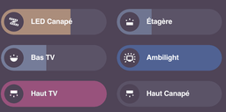

# HA-Home-Tracker

Recurring household chores ("Mow the Lawn", "Water Plants"…) shown as Bubble Card
buttons. Each card's bar fills (or empties) as the chore gets closer to due, can show
a subheading such as "Due in 3 days", and resets when you tap it.



This repo contains no custom integration. Scheduling is handled by
[Chore Calendar](https://github.com/tcarney/ha-chore-calendar), an actively maintained
HACS integration. This repo adds the missing piece: a progress percentage that a Bubble
Card slider can display.

> An earlier version targeted [Chore Helper](https://github.com/bmcclure/ha-chore-helper).
> That integration hasn't been updated since July 2024. It calls
> `async_forward_entry_setup`, which was removed in Home Assistant 2025.6, so it was dropped.

| You want                                           | Provided by                                                     |
| -------------------------------------------------- | --------------------------------------------------------------- |
| Task name, frequency (daily/weekly/monthly/yearly) | Chore Calendar                                                  |
| Pick which weekdays it repeats on                  | Chore Calendar *scheduled* chore (`byday`)                      |
| Repeat on fixed days vs. a time after completion   | *scheduled* (fixed grid) vs. *interval* (counted from last done) |
| Icon per task                                      | The card's `icon:`                                              |
| Bar shows progress until due, filling or emptying  | `chore_progress` macro + Template Helper + Bubble Card slider   |
| Optional "time until due" subheading               | `chore_due_text` macro in the card's `state_content`            |
| Tap to reset                                       | Card tap action → `chore_calendar.complete_item`                |

## Files

| File | Purpose |
| --- | --- |
| [`custom_templates/chore_tracker.jinja`](custom_templates/chore_tracker.jinja) | Jinja macros: `chore_progress` (0–100 %) and `chore_due_text` ("Due in 3 days") |
| [`examples/bubble-card-chore.yaml`](examples/bubble-card-chore.yaml) | One fully commented chore card |
| [`examples/chores-dashboard.yaml`](examples/chores-dashboard.yaml) | The full Chores dashboard: five starter chores as a Bubble Card grid |
| [`scripts/build_dashboard.py`](scripts/build_dashboard.py) | Generates `chores-dashboard.yaml` from a list of chores (name, sensors, icon, colour, cycle length) |

## Setup

### 1. Install the prerequisites (HACS)

- **Chore Calendar**: HACS → ⋮ → Custom repositories → add
  `https://github.com/tcarney/ha-chore-calendar` (category *Integration*), download it,
  restart Home Assistant, then go to Settings → Devices & Services → Add integration →
  *Chore Calendar* and create a list (e.g. `Chores`).
- **Bubble Card**: HACS → Frontend → "Bubble Card".

### 2. Create chores

Use Chore Calendar's card or the `chore_calendar.create_item` action. Each chore gets a
sensor (state `pending` / `due` / `overdue` / `completed`, with `next_due` and
`last_completed` attributes). For example:

```yaml
# Fixed days: every Saturday, due 18:00, shows as "due" from Thursday evening
action: chore_calendar.create_item
data:
  entity_id: calendar.chores
  chore_name: Mow the Lawn
  scheduled: {frequency: weekly, interval: 1, byday: [sat], dtstart: "18:00:00"}
  pending_period: {days: 2}
  grace_period: {days: 1}
```

```yaml
# Counted from the last completion: 3 days after you last watered
action: chore_calendar.create_item
data:
  entity_id: calendar.chores
  chore_name: Water Plants
  interval: {frequency: daily, interval: 3}
  pending_period: {days: 1}
  grace_period: {days: 1}
```

### 3. Add the macros

Copy [`custom_templates/chore_tracker.jinja`](custom_templates/chore_tracker.jinja) to
`<config>/custom_templates/chore_tracker.jinja`. Create the `custom_templates` folder if
it doesn't exist. Then go to Developer tools → Actions and run
`homeassistant.reload_custom_templates`. No restart is needed.

### 4. Create a progress sensor per chore

Settings → Devices & Services → Helpers → **Create helper** → **Template** → **Template a sensor**:

- **Name**: `Mow the Lawn Progress` (creates `sensor.mow_the_lawn_progress`)
- **State template**: the second argument is the chore's cycle length in days. It can be
  left out for interval chores.
  ```jinja
  
  {{ chore_progress('sensor.chores_mow_the_lawn', 7) }}
  ```
- **Unit of measurement**: `%`. Bubble Card reads a `%` sensor directly as the fill level.
- **State class**: `Measurement`

The value runs from `0` right after the chore is done to `100` at its due time, and it
updates every minute. If a fixed-day chore is done early, Chore Calendar keeps `next_due`
on the period you just satisfied until it passes. The macro accounts for this, so the bar
still resets the moment you tap it.

### 5. Add the cards

For one card: Dashboard → Edit → Add card → **Manual**, and paste
[`examples/bubble-card-chore.yaml`](examples/bubble-card-chore.yaml). Replace the entity IDs
with your own.

For a whole dashboard: Settings → Dashboards → **Add dashboard** → *New dashboard from
scratch*, open it, then ⋮ → Edit → ⋮ → **Raw configuration editor**, and paste
[`examples/chores-dashboard.yaml`](examples/chores-dashboard.yaml). To change the chore list,
edit `CHORES` in [`scripts/build_dashboard.py`](scripts/build_dashboard.py) and run
`python3 scripts/build_dashboard.py` (requires PyYAML) to regenerate it.

| Option | Effect |
| --- | --- |
| `name`, `icon` | Card title and icon |
| `invert_slider_value: true` | Bar starts full and **empties** toward the due date instead of filling up |
| `state_content` | The subheading. Delete it to hide the subheading |
| `styles` → `.bubble-range-fill` | Bar colour |
| `tap_action` / `button_action.tap_action` | Tap = `chore_calendar.complete_item` (reset). Uncomment `confirmation:` to ask first |
| `hold_action` | Hold = more-info for the chore |
